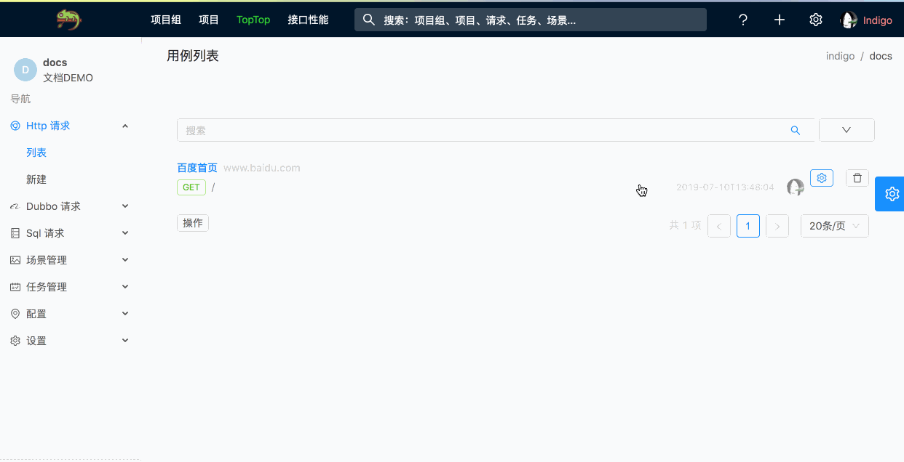

# 添加断言

[查看所有断言参考和内部实现机制](/zh-cn/assertion.md)

> 可先点击一下发送，然后在标签页 `结果和断言`->`响应断言` 中的面板 `3` 处添加断言。
> 

## 响应消息码

> 上图中第一条断言断言响应码为 `200`，`$.status` 可以指定响应码。

## 非 Json 响应消息体

> 响应体的类型可以划分为 `json` 和 `非json` 类型。

> 上图中的示例是一个 `GET` 请求，响应体为 `HTML(非json)` 类型，第二条断言就是断言响应体中包含 `百度一下，你就知道` 这个字符串。

> 添加完断言后，在点击下 `发送` 按钮。可以看到这个用例请求的测试报告。
> 

## Json 响应消息体

> 
> 左边的 `$.` 开头的是 [JsonPath](https://goessner.net/articles/JsonPath/)，`entity` 代表响应的消息体，基本原则就是使用 `JsonPath` 选定Json结构体的子属性，然后后面进行相应的断言。

## 响应消息头

> 
> `$.headers` 代表响应头对象。
